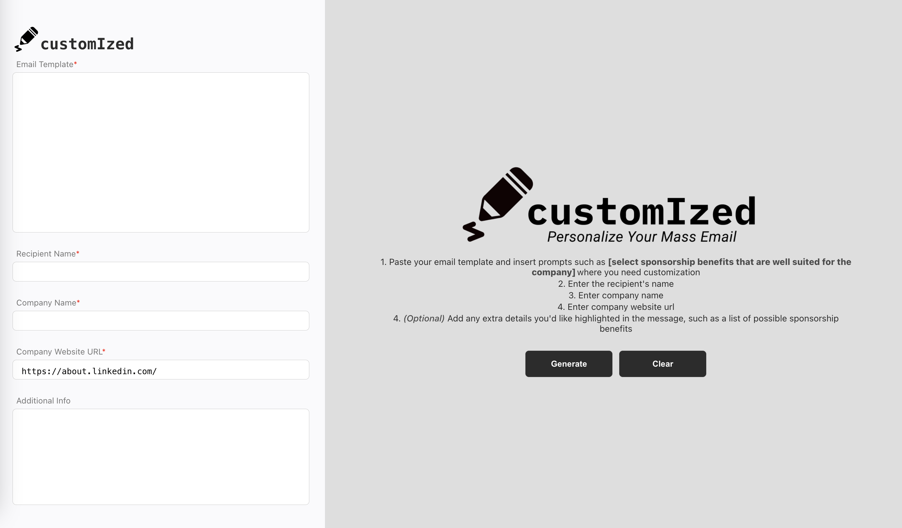

# customIzed
Personalize your mass email template to your corporate outreach's interests! Paste your email template, recipient's name, company name, and company url; customIzed will take care of the rest! 

Some functionality includes:
- Extract information from a company's website and cater the email to their interests. 
- Generating two variations of the filled in email template
- Users can select a variant and regenerate to get two new templates, similar to the selected template

## Set up
1 . Install Node.js and npm by visiting https://nodejs.org/en/download/
   
2. Get your personal Gemini API key by visiting https://aistudio.google.com/app/apikey and edit the .env file to set `GOOGLE_API_KEY = YOUR_API_KEY`

3. Install the following dependencies:```npm install express cors dotenv cheerio react-markdown remark-gfm```
   
## Run
First run ```cd frontend``` and ```npm run dev```
Then run ```cd backend``` and ```node server.js```

***Enjoy your customized email!***


_Here is the mockup: https://www.figma.com/design/VZiGLAs6Mz2M92cGgLVNsb/customIzed?node-id=0-1&t=V6esf7fP11ZOvspj-1_ 

